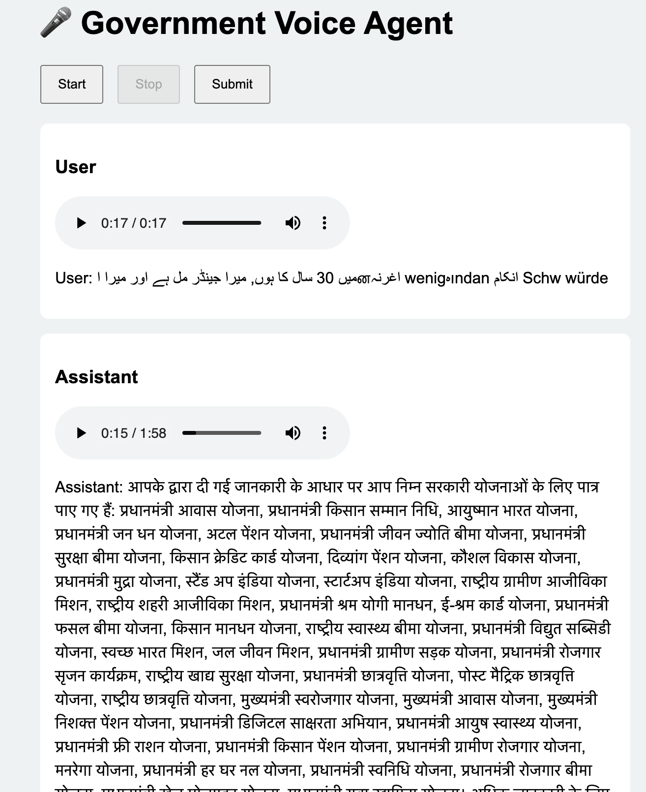
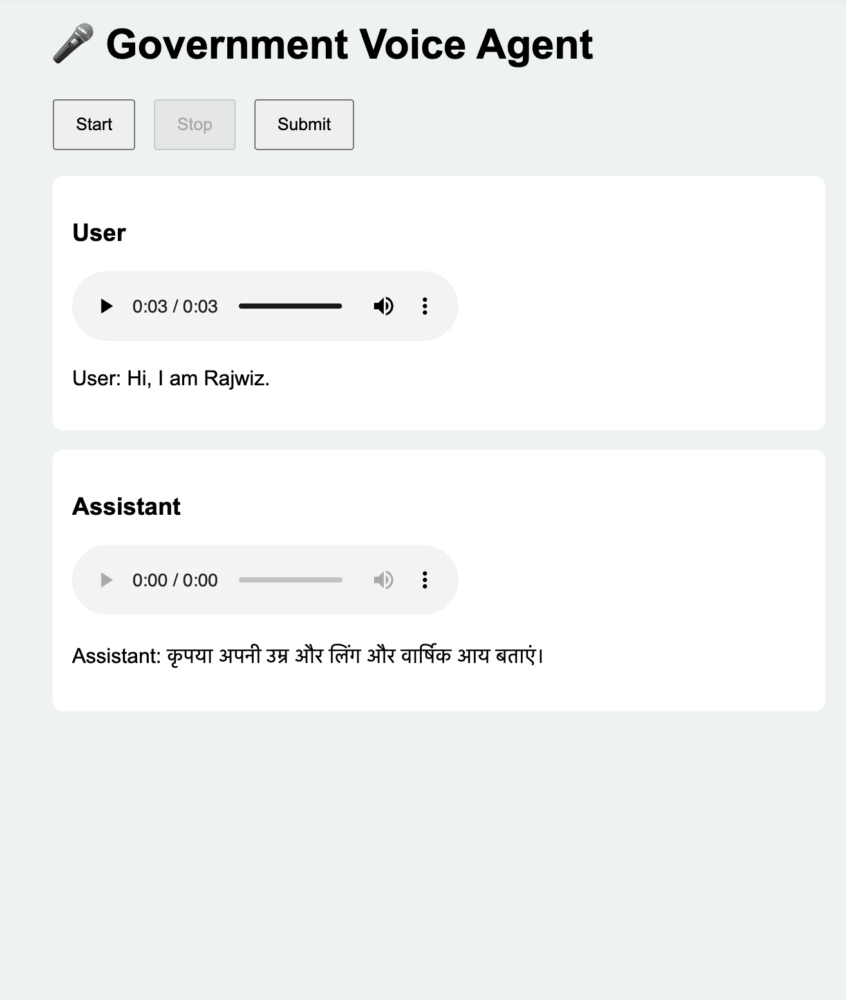
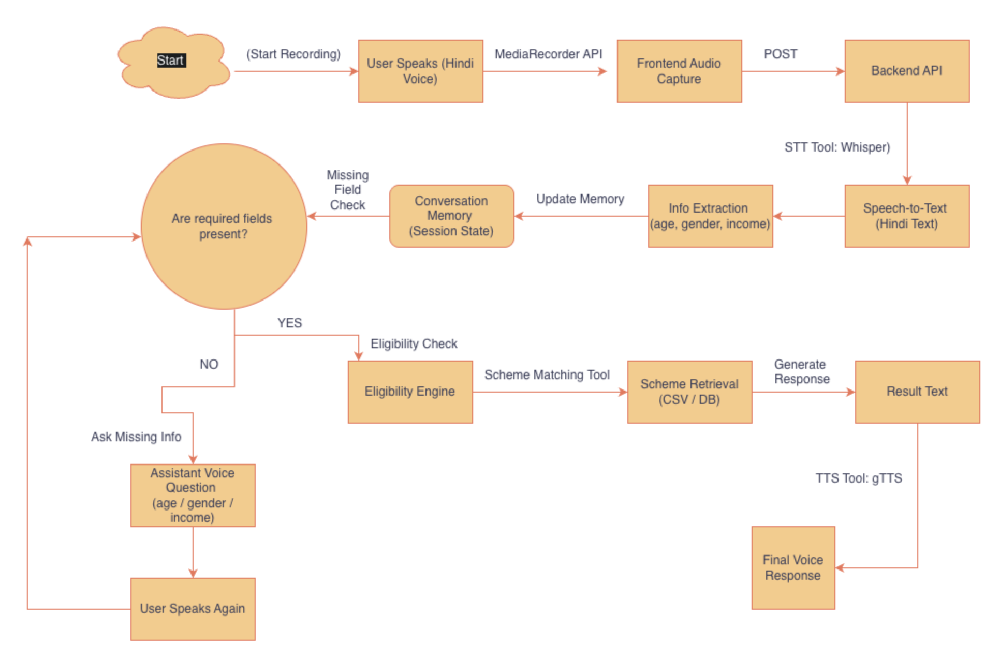

# 🎤 Hindi Government Voice Agent For Government Schemes

**Voice-First Agentic AI for Government Scheme Eligibility (Hindi)**

**Hindi Government Voice Agent** is a **voice-first, agentic AI system** that helps Indian citizens identify **government and public welfare schemes** they are eligible for — **entirely through voice interaction in Hindi**.
Build a **native-language, voice-first AI agent** that can autonomously reason, plan, and act to assist users in identifying government schemes — meeting all **agentic AI requirements**.

## 🖼️ Sample Agent Responses

The screenshots below show real responses generated by the Hindi Government Voice Agent during a voice-based interaction.

<table>
  <tr>
    <td width="50%" align="center">
      
    </td>
    <td width="50%" align="center">
      
    </td>
  </tr>
</table>


---

## 🧠 Key Capabilities

✔️ **Voice-first interaction** (STT → Agent → TTS)
✔️ **Hindi-only pipeline** (No English reasoning exposed)
✔️ **Multi-turn memory & state management**
✔️ **Planner → Executor → Evaluator agent workflow**
✔️ **Tool usage** (Eligibility engine + CSV database)
✔️ **Failure handling & defaults**
✔️ **End-to-end runnable system**

---
### High-Level Architecture Diagram


---
## 🗣️ Example User Flow

**User:**

> “मैं सरकारी योजनाओं के बारे में जानना चाहता हूँ।”

**Agent (Voice):**

> “कृपया अपनी उम्र, लिंग और वार्षिक आय बताएं।”

**User:**

> “मैं 32 साल का पुरुष हूँ और मेरी सालाना आय 1.5 लाख है।”

**Agent (Voice):**

> “आप प्रधानमंत्री आवास योजना और आयुष्मान भारत योजना के लिए पात्र हैं…”
---


## 📁 Project Structure

```
hindi-gov-voice-agent/
│
├── backend/
│   ├── server.py        # FastAPI server + agent orchestration
│   ├── logic.py         # Memory, extraction, eligibility logic
│   ├── tts.py           # Hindi text-to-speech utilities
│   └── agent/
│       ├── planner.py   # Decision planning logic
│       ├── executor.py  # Tool execution
│       └── evaluator.py # Final response evaluation
│
├── frontend/
│   ├── index.html       # UI layout
│   ├── script.js        # Recording, submit, audio playback
│   ├── app.js           # UI event wiring
│   └── style.css        # UI styling
│
├── database/
│   └── schemes.csv      # Government schemes dataset
│
├── audio/               # Generated TTS audio files
├── temp/                # Temporary Whisper audio files
├── requirements.txt     # Python dependencies
├── README.md            # Project documentation
└── venv/                # Virtual environment
```

---

## ⚙️ Setup Instructions

### 1️⃣ Clone Repository

```bash
git clone https://github.com/Rajesh-1234567/Voice-Based-Native-Language-Service-Agent-For-Government-Schemes/
cd hindi-gov-voice-agent
```

### 2️⃣ Create Virtual Environment

```bash
python3 -m venv venv
source venv/bin/activate
```

### 3️⃣ Install Dependencies

```bash
pip install -r requirements.txt
```

### 4️⃣ Run Server

```bash
uvicorn backend.server:app --reload
```

### 5️⃣ Open UI

```
http://127.0.0.1:8000
```

🎤 **Allow microphone access in browser**

---

## 📊 Evaluation Alignment

| Requirement             | Status                       |
| ----------------------- | ---------------------------- |
| Voice-first interaction | ✅                            |
| Native Indian language  | ✅ Hindi                      |
| Agentic workflow        | ✅ Planner–Executor–Evaluator |
| Tool usage              | ✅ Eligibility + DB           |
| Memory across turns     | ✅                            |
| Failure handling        | ✅                            |
| Runnable code           | ✅                            |
| Not a chatbot           | ✅                            |

---
## 🚀 Future Enhancements

* Multi-language support (Tamil, Telugu, Marathi, Odia)
* Replace CSV with government APIs
* User authentication
* Scheme application assistance
* Offline STT/TTS

---
## 📐 Detailed Architecture & Design

For a complete breakdown of system design, agent workflow, memory model, and implementation decisions,  
see 👉 **[ARCHITECTURE.md](ARCHITECTURE.md)**.


## 🏁 Conclusion

This project demonstrates a **true voice-first agentic AI system**, not a scripted chatbot.
It showcases **autonomous reasoning, planning, tool usage, memory, and recovery** in a **native Indian language**, fulfilling all mandatory requirements.

---
